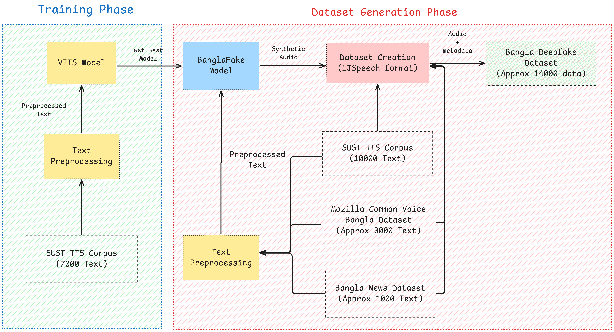

# BanglaFake

BanglaFake is a specialized Bengali deepfake audio dataset designed for research and evaluation of audio deepfake detection systems targeting Bengali language content.

## Overview

Deepfake technology has seen rapid advancements, particularly in the domain of synthetic audio, which has led to increased challenges in detecting fake audio. While significant progress has been made in detecting deepfake videos, the detection of synthetic audio remains a difficult task due to several limitations, including the scarcity of large, diverse datasets, language-specific nuances, and subtle acoustic features that make distinguishing between real and fake speech more challenging. In this paper, we introduce a novel Bengali Deepfake Audio Dataset, consisting of 12,260 real and 13,260 deepfake utterances, designed to aid in the development of deepfake detection models specifically for Bengali, a language with limited resources in this area. The synthetic audio in our dataset is generated using state-of-the-art (SOTA) Text-to-Speech (TTS) techniques to retain naturalness and high quality, making the task of detection even more challenging. To assess the quality and effectiveness of the dataset, we perform both qualitative and quantitative evaluations. The qualitative evaluation uses the Mean Opinion Score (MOS) methodology, with evaluations from 30 native Bengali speakers, which indicate high perceptual quality. The Robust-MOS scores for naturalness and intelligibility are 3.39 and 4.01, respectively. The quantitative evaluation includes the Perceptual Evaluation of Speech Quality (PESQ) metric, which gives an average score of 1.39 for the synthetic audio, and a t-SNE visualization of the Mel Frequency Cepstral Coefficients (MFCCs), revealing significant overlap between real and fake audio samples, highlighting the difficulty in distinguishing between them. This dataset serves as a crucial resource for advancing deepfake audio detection in Bengali and provides insights into the limitations of current detection methods. Our findings demonstrate the importance of high-quality synthetic audio generation techniques and contribute to the ongoing research in the detection of Bengali deepfake audio.

You can find the datadset in [Hugging Face](https://huggingface.co/datasets/sifat1221/banglaFake)



## Dataset Details

The BanglaFake dataset includes:

- Natural Bengali speech samples
- Synthetically generated Bengali speech
- Multiple speaker identities
- Detailed metadata and annotations

## Training

To train the model with your own data follow the given procedure:

- Prepare your dataset in [LJ Speech](https://keithito.com/LJ-Speech-Dataset/) format.
- Adjust your necessary config and run the `training_scripts/vits-bn-train-updated-24-dec.ipynb`
- For faster execution better to have 48 GB VRAM with L40S GPU. You can also train on Kaggle but it will take comperatively more time than L40S.

## Inference

- Select your desired checkpoint of our trained moded in [Hugging Face](https://huggingface.co/sifat1221)
- Update checkpoint in `inference_scripts/vits-bn-infer.ipynb` script & run.
- You can use kaggle T4 GPU for inference.

---

If you use BanglaFake in your research, please cite:

```
@article{banglafake2024,
  title={BanglaFake: Constructing and Evaluating a Specialized Bengali Deepfake Audio Dataset},
  author={[Istiaq Ahmed Fahad, Kamruzzaman Asif, Sifat Sikder]},
  year={2024}
}
```
